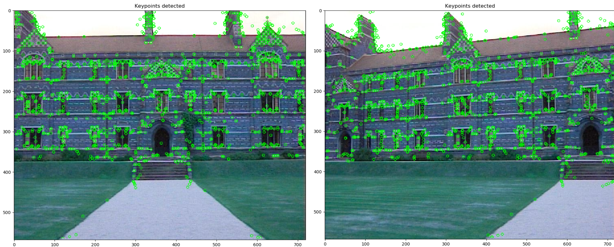
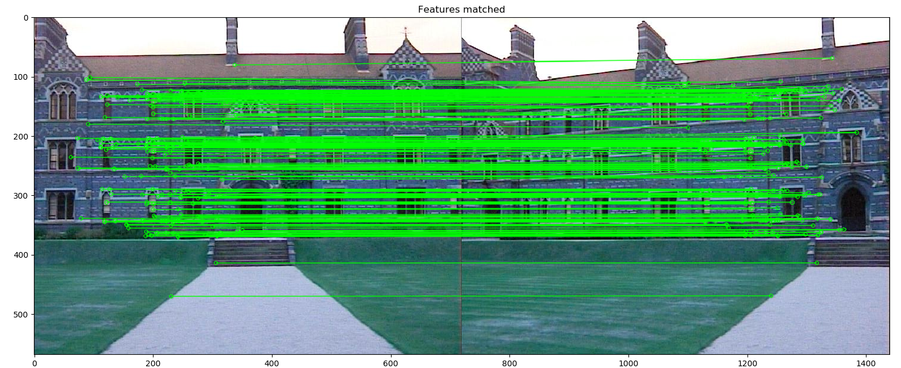
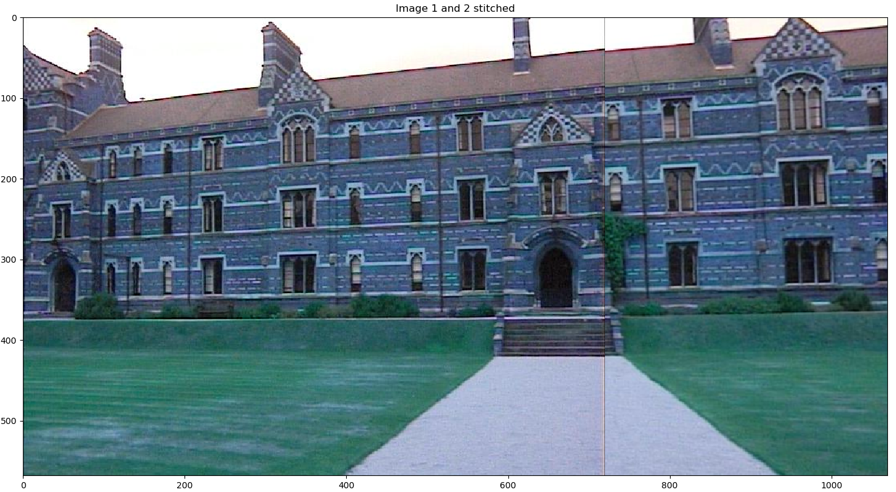
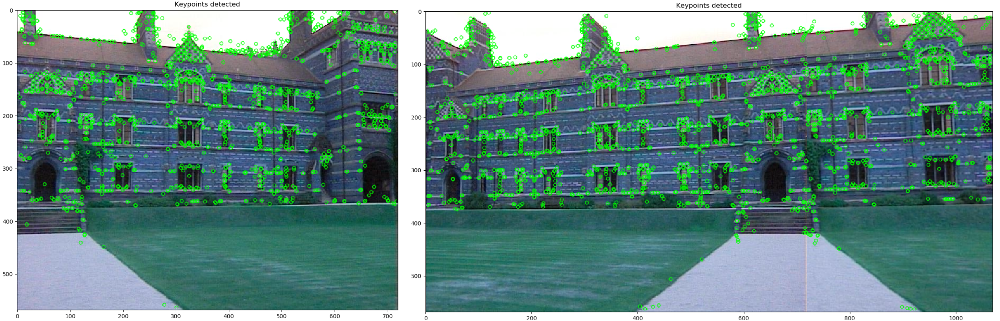
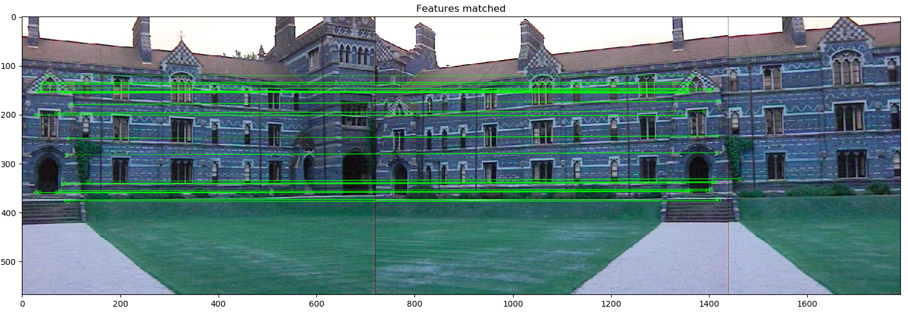
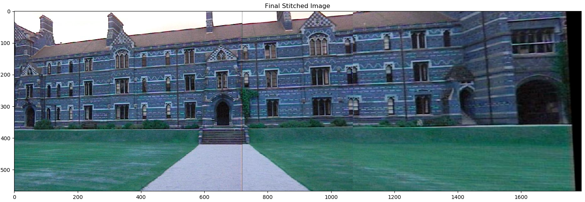

# Image Stitching

The objective was to stitch three images together. First, keypoints were detected in two images and features were matched between the two. 

  

  

 

The matched features were used to calculate the homography matrix. This matrix was used to warp the images and then finally stitch them together.

  

To stitch the third image to this stitched image, the same process is repeated. Keypoints are detected and matched in the stitched image and the third image.

  

  

Again, the stitched image and third image are warped and stitched together using the calculated homography matrix between the two to get the final stitched image consisting all the three images.

  

